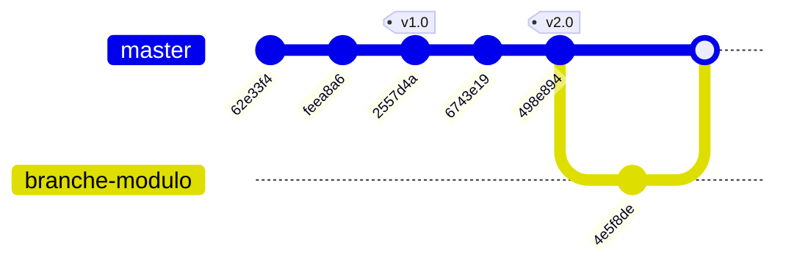

# Tutoriel Introduction à git

## 1. Configuration de notre identité
```sh
git config --global user.name "Julien"
git config --global user.email "julien.crypt@gmail.com"
```

## 2. Création d'un dossier pour notre projet et initialisation du dépôt git
```sh
mkdir projet
cd projet
git init
```

## 3. Création d'un Fichier C++ 
Créons un fichier `calcul.cpp` contenant une simple addition :

```cpp
#include <iostream>

int addition(int a, int b) {
    return a + b;
}

int main() {
    std::cout << "5 + 3 = " << addition(5, 3) << std::endl;
    return 0;
}
```

Ajoutons le au suivi git et créons un premier commit:

```sh
git add calcul.cpp
git commit -m "Création d'un programme de calcul comportant une simple addition"
```

## 4. Ajout d'une nouvelle fonctionnalité
A cette occasion, nous introduisons accidentellement une regression.

Apportons ces modifications à `calcul.cpp`
```cpp
...
// Nouvelle fonctionnalité : multiplication
int multiplication(int a, int b) {
    return a * b; 
}

int addition(int a, int b) {
    return a - b; // Erreur : L'addition a été remplacée par une soustraction par le dev
}
...
```

Effectuons un commit:
```sh
git add calcul.cpp
git commit -m "Ajout d'une fonctionnalité de multiplication"
```

## 5. Analyse de l'historique des commits pour identifier quand l'erreur a été introduite

```sh
git log --oneline 
```

```sh
feea8a6 (HEAD -> master) Ajout d'une fonctionnalité de multiplication
62e33f4 Création d'un programme de calcul comportant une simple addition
```

Puis, `git diff` pour voir la différence entre le dernier commit et le précédent :

```sh
git diff feea8a6 62e33f4
```

Cette commande nous permet de visualiser les lignes supprimées ou rajoutées entre les deux commits:
```diff
...
-// Nouvelle fonctionnalité : multiplication
-int multiplication(int a, int b) {
-    return a * b;
-}
-
 int addition(int a, int b) {
-    return a - b; // Erreur : L'addition a été remplacée par une soustraction par le dev
+    return a + b;
 }
...
```

## 6. Correction du bug
Modification de `calcul.cpp`:
```cpp
...
int addition(int a, int b) {
    return a + b;
}
...
```

```sh
git add calcul.cpp
git commit -m "Correction du bug impactant l'addition"
```

```sh
git log --oneline 
```

```sh
2557d4a (HEAD -> master) Correction du bug impactant l'addition
feea8a6 Ajout d'une fonctionnalité de multiplication
62e33f4 Création d'un programme de calcul comportant une simple addition
```

## 7. Notion de tag
Suite à une phase de tests concluante, la version actuelle de notre programme va être distribuée auprès d'utilisateurs ou clients.
Afin d'assurer une traçabilité des versions, nous allons placer une "étiquette" (tag) sur le dernier commit.
Il sera ainsi facile, dans le futur, de retrouver l'état du code précis qui correspond à cette version.

```sh
git tag -a v1.0 -m "Version 1.0 stable avec addition et multiplication" 2557d4a
```

```sh
git log --oneline                                                              
```

```sh
2557d4a (HEAD -> master, tag: v1.0) Correction du bug impactant l'addition
feea8a6 Ajout d'une fonctionnalité de multiplication
62e33f4 Création d'un programme de calcul comportant une simple addition
```

## 8. Continuons à ajouter des fonctionnalités

Ajout dans `calcul.cpp`:
```cpp
...
int soustraction(int a, int b) {
    return a - b;
}
...
```

```sh
git add calcul.cpp
git commit -m "Ajout d'une fonctionnalité soustraction"
```

Ajout dans `calcul.cpp`:
```cpp
...
int division(int a, int b) {
    return a / b;
}
...
```

```sh
git add calcul.cpp
git commit -m "Ajout d'une fonctionnalité division"
```

```sh
git log --oneline
```

```sh
498e894 (HEAD -> master) Ajout d'une fonctionnalité division
6743e19 Ajout d'une fonctionnalité soustraction
2557d4a (tag: v1.0) Correction du bug impactant l'addition
feea8a6 Ajout d'une fonctionnalité de multiplication
62e33f4 Création d'un programme de calcul comportant une simple addition
```

## 9. Création d'un nouveau tag, en vue de diffuser une nouvelle version
```sh
git tag -a v2.0 -m "Version 2.0. Nouveautés: soustraction et division" 498e894
```

```sh
git log --oneline                                                             
```

```sh
498e894 (HEAD -> master, tag: v2.0) Ajout d'une fonctionnalité division
6743e19 Ajout d'une fonctionnalité soustraction
2557d4a (tag: v1.0) Correction du bug impactant l'addition
feea8a6 Ajout d'une fonctionnalité de multiplication
62e33f4 Création d'un programme de calcul comportant une simple addition
```

## 10. Naviguer vers une version précédente

Retournons sur la version 1.0:
```sh
git checkout v1.0
```

Inspectons calculs.cpp: Nous sommes bien de retour à la version 1.0

Revenons sur le dernier commit:
```sh
git switch -
```

Vérifions calculs.cpp: Nous sommes bien sur la version la plus récente

## 11. Git et le travail en équipe: Les branches

Une branche permet de créer un environnement de travail isolé.
Plusieurs développeurs peuvent travailler sur des branches différentes, de manière simultanée.

Création d'une branche dédiée au travail sur la fonctionnalité modulo:

```sh
git branch branche-modulo
git switch branche-modulo
```

Ajout dans `calcul.cpp`:
```cpp
int modulo(int a, int b) {
    return a % b;
}
```

```sh
git add calcul.cpp
git commit -m "Ajout de la fonction modulo"
```

Retournons sur la branche principale:
```sh
git switch master
```

Observons le contenu de `calcul.cpp`: Elle ne comporte pas la fonction modulo.

Retournons sur la branche "branche-modulo":
```sh
git switch branche-modulo
```
Observons le contenu de `calcul.cpp`: Vérifiez que que la fonction `modulo` est toujours présente lorsque nous sommes sur la branche `branche-modulo`.

## 12. Fusion de branches

Fusionnons le contenu de la branche `branche-modulo` vers la branche principale `master`:

```sh
git switch master
git merge branche-modulo
```

Récapitulatif:



# Exercice

## Synchronisation avec un dépôt distant
- Créez un compte github.
- Créez un dépôt public github.
- Documentez vous sur les commandes `git clone`, `git pull` et `git push`.
- Créez un projet (simple) de votre choix  et effectuez des synchronisations entre votre ordinateur et le dépôt github.
