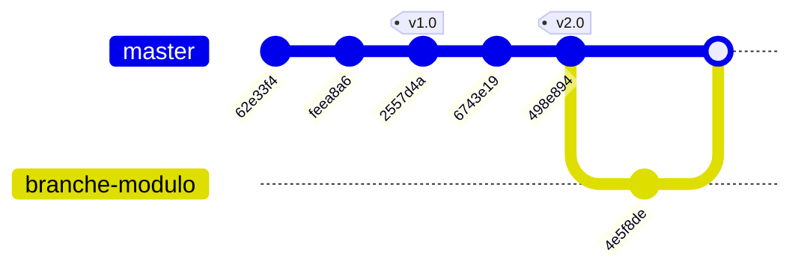

# Tutoriel Introduction à git

## 1. Configuration de notre identité
```sh
git config --global user.name "Julien"
git config --global user.email "julien.crypt@gmail.com"
```

## 2. Création d'un dossier pour notre projet et initialisation du dépôt git
```sh
mkdir projet
cd projet
git init
```

## 3. Création d'un Fichier C++ 
Créons un fichier `calcul.cpp` contenant une simple addition :

```cpp
#include <iostream>

int addition(int a, int b) {
    return a + b;
}

int main() {
    std::cout << "5 + 3 = " << addition(5, 3) << std::endl;
    return 0;
}
```

Ajoutons le au suivi git et créons un premier commit:

```sh
git add calcul.cpp
git commit -m "Création d'un programme de calcul comportant une simple addition"
```

## 4. Ajout d'une nouvelle fonctionnalité
A cette occasion, nous introduisons accidentellement une regression.

Apportons ces modifications à `calcul.cpp`
```cpp
...
// Nouvelle fonctionnalité : multiplication
int multiplication(int a, int b) {
    return a * b; 
}

int addition(int a, int b) {
    return a - b; // Erreur : L'addition a été remplacée par une soustraction par le dev
}
...
```

Effectuons un commit:
```sh
git add calcul.cpp
git commit -m "Ajout d'une fonctionnalité de multiplication"
```

## 5. Analyse de l'historique des commits pour identifier quand l'erreur a été introduite

```sh
git log --oneline 
```

```sh
feea8a6 (HEAD -> master) Ajout d'une fonctionnalité de multiplication
62e33f4 Création d'un programme de calcul comportant une simple addition
```

Puis, `git diff` pour voir la différence entre le dernier commit et le précédent :

```sh
git diff feea8a6 62e33f4
```

Cette commande nous permet de visualiser les lignes supprimées ou rajoutées entre les deux commits:
```diff
...
-// Nouvelle fonctionnalité : multiplication
-int multiplication(int a, int b) {
-    return a * b;
-}
-
 int addition(int a, int b) {
-    return a - b; // Erreur : L'addition a été remplacée par une soustraction par le dev
+    return a + b;
 }
...
```

## 6. Correction du bug
Modification de `calcul.cpp`:
```cpp
...
int addition(int a, int b) {
    return a + b;
}
...
```

```sh
git add calcul.cpp
git commit -m "Correction du bug impactant l'addition"
```

```sh
git log --oneline 
```

```sh
2557d4a (HEAD -> master) Correction du bug impactant l'addition
feea8a6 Ajout d'une fonctionnalité de multiplication
62e33f4 Création d'un programme de calcul comportant une simple addition
```

## 7. Notion de tag
Suite à une phase de tests concluante, la version actuelle de notre programme va être distribuée auprès d'utilisateurs ou clients.
Afin d'assurer une traçabilité des versions, nous allons placer une "étiquette" (tag) sur le dernier commit.
Il sera ainsi facile, dans le futur, de retrouver l'état du code précis qui correspond à cette version.

```sh
git tag -a v1.0 -m "Version 1.0 stable avec addition et multiplication" 2557d4a
```

```sh
git log --oneline                                                              
```

```sh
2557d4a (HEAD -> master, tag: v1.0) Correction du bug impactant l'addition
feea8a6 Ajout d'une fonctionnalité de multiplication
62e33f4 Création d'un programme de calcul comportant une simple addition
```

## 8. Continuons à ajouter des fonctionnalités

Ajout dans `calcul.cpp`:
```cpp
...
int soustraction(int a, int b) {
    return a - b;
}
...
```

```sh
git add calcul.cpp
git commit -m "Ajout d'une fonctionnalité soustraction"
```

Ajout dans `calcul.cpp`:
```cpp
...
int division(int a, int b) {
    return a / b;
}
...
```

Note: Modifiez la fonction main pour ajouter un appel à la fonction division.

```sh
git add calcul.cpp
git commit -m "Ajout d'une fonctionnalité division"
```

```sh
git log --oneline
```

```sh
498e894 (HEAD -> master) Ajout d'une fonctionnalité division
6743e19 Ajout d'une fonctionnalité soustraction
2557d4a (tag: v1.0) Correction du bug impactant l'addition
feea8a6 Ajout d'une fonctionnalité de multiplication
62e33f4 Création d'un programme de calcul comportant une simple addition
```

## 9. Création d'un nouveau tag, en vue de diffuser une nouvelle version
```sh
git tag -a v2.0 -m "Version 2.0. Nouveautés: soustraction et division" 498e894
```

```sh
git log --oneline                                                             
```

```sh
498e894 (HEAD -> master, tag: v2.0) Ajout d'une fonctionnalité division
6743e19 Ajout d'une fonctionnalité soustraction
2557d4a (tag: v1.0) Correction du bug impactant l'addition
feea8a6 Ajout d'une fonctionnalité de multiplication
62e33f4 Création d'un programme de calcul comportant une simple addition
```

## 10. Naviguer vers une version précédente

Retournons sur la version 1.0:
```sh
git checkout v1.0
```

Inspectons calculs.cpp: Nous sommes bien de retour à la version 1.0

Revenons sur le dernier commit:
```sh
git switch -
```

Vérifions calculs.cpp: Nous sommes bien sur la version la plus récente

## 11. Git et le travail en équipe: Les branches

Une branche permet de créer un environnement de travail isolé.
Plusieurs développeurs peuvent travailler sur des branches différentes, de manière simultanée.

Création d'une branche dédiée au travail sur la fonctionnalité modulo:

```sh
git branch branche-modulo
git switch branche-modulo
```

Ajout dans `calcul.cpp`:
```cpp
int modulo(int a, int b) {
    return a % b;
}
```

```sh
git add calcul.cpp
git commit -m "Ajout de la fonction modulo"
```

Retournons sur la branche principale:
```sh
git switch master
```

Observons le contenu de `calcul.cpp`: Elle ne comporte pas la fonction modulo.

Retournons sur la branche "branche-modulo":
```sh
git switch branche-modulo
```
Observons le contenu de `calcul.cpp`: Vérifiez que que la fonction `modulo` est toujours présente lorsque nous sommes sur la branche `branche-modulo`.

## 12. Fusion de branches

Fusionnons le contenu de la branche `branche-modulo` vers la branche principale `master`:

```sh
git switch master
git merge branche-modulo
```

Récapitulatif:



## Divers

Afficher le status (Fichiers modifiés depuis le dernier commit, branche courante, ...)
```sh
git status
```

Historique des commits:
```sh
git log
```

Afficher la liste des branches:
```sh
git branch
```

# Exercices

## 1. Gestion d'un correctif pour plusieurs versions
- Reprenez le projet du tutoriel.
- Deux versions (v1.0 et v2.0) ont été déployées auprès de différents clients.
- Supposons qu'un client utilisant la version v1.0 découvre un bug.
- Après analyse, vous identifiez que ce bug est présent dans toutes les versions de l’application.
- Vous pouvez corriger ce bug dans le code.
- Une solution serait d’appliquer le correctif à v2.0 et d’inciter tous les clients à basculer sur cette version.
- Cependant, certains clients ne veulent pas migrer vers v2.0 car elle introduit de nouvelles fonctionnalités non désirées.
- Quelle stratégie proposez-vous pour fournir un correctif aux clients utilisant v1.0 sans leur imposer de migrer vers la version v2.0 ?

<details>
  <summary>💡 Voir une solution</summary>

Création d'une branche `hotfix/v1.0`, basée sur `v1.0`.
Cette branche a vocation d'acceuillir tous les correctifs concernant la version `v1.0`.

```sh
git branch hotfix/v1.0 v1.0
git switch hotfix/v1.0
```

Apporter le correctif sur cette branche.
On suppose que calcul.cpp a été modifié en conséquence.
Validons cette modification:
```sh
git add calcul.cpp
git commit -m "Correction du bug X sur la version 1.0"
```

Créer un tag pour identifier cette correction:
```sh
git tag -a v1.1 -m "Version 1.1 : Correction du bug xxx pour v1.0"
```

Les clients qui utilisent la version `v1.0`, mais qui ne souhaitent pas passer sur la `v2.0` peuvent désormais passer à la version `v1.1`.

Créer une branche `hotfix/v2.0` et y fusionner la branche `hotfix/v1.0`, afin de proposer le correctif aux utilisateurs de la version `v2.0`:
```sh
git branch hotfix/v2.0 v2.0
git switch hotfix/v2.0
git merge hotfix/v1.0
```

Créer un tag pour identifier la sous version:
```
git tag -a v2.1 -m "Version 2.1 : Correction du bug xxx pour v2.0"
```

Les clients qui utilisent la version `v2.0` peuvent passer à la version `v2.1`.

Fusionner la branche `hotfix/v1.0` vers `master` pour que les versions futures bénéficient également du correctif.
```sh
git switch master
git merge hotfix/v1.0
```

Vérifications:
```sh
git switch hotfix/v1.0
git log --oneline     
efe12b4 (HEAD -> hotfix/v1.0, tag: v1.1) Correction du bug X sur la version 1.0
2557d4a (tag: v1.0) Correction du bug impactant l'addition
feea8a6 Ajout d'une fonctionnalité de multiplication
62e33f4 Création d'un programme de calcul comportant une simple addition
                                                                                                                              
git switch hotfix/v2.0
git log --oneline     
ffb3db5 (HEAD -> hotfix/v2.0, tag: v2.1) Merge branch 'hotfix/v1.0' into hotfix/v2.0
efe12b4 (tag: v1.1, hotfix/v1.0) Correction du bug X sur la version 1.0
498e894 (tag: v2.0) Ajout d'une fonctionnalité division
6743e19 Ajout d'une fonctionnalité soustraction
2557d4a (tag: v1.0) Correction du bug impactant l'addition
feea8a6 Ajout d'une fonctionnalité de multiplication
62e33f4 Création d'un programme de calcul comportant une simple addition
```
</details>

## 2. Créer une image Docker pour chaque version
- Écrire un Dockerfile pour compiler et exécuter le programme C++.
- Créer deux images Docker:
    - Une image pour la version 1 (incluant les correctifs)
    - Une image pour la version 2 (incluant les correctifs)
- Exécutez un container pour chaque image

<details>
  <summary>💡 Voir une solution</summary>

Création d'un Dockerfile
```Dockerfile
FROM gcc:latest
COPY calcul.cpp calcul.cpp
RUN g++ calcul.cpp
CMD ["./a.out"]
```

Création d'une image Docker pour la version 1:
```sh
git switch hotfix/v1.0
docker build -t calcul:v1 .
```

Création d'un container pour l'image comportant la version 1:
```sh
docker run calcul:v1
```
</details>

## 3. Synchronisation avec un dépôt distant
- Créez un compte github.
- Créez un dépôt public github.
- Documentez vous sur les commandes `git clone`, `git pull` et `git push`.
- Créez un projet (simple) de votre choix  et effectuez des synchronisations entre votre ordinateur et le dépôt github.

<details>
  <summary>💡 Voir une solution</summary>

- Créez un compte github (Exemple: "tag5")
- Créez un dépôt public avec ce compte github (Exemple: "todo")
- Clonez ce dépôt sur votre ordinateur: (le contenu de ce repo est "téléchargé" dans le dossier `todo`)
```sh
git clone https://github.com/tag5/todo
cd todo
```

- Créez un fichier dans votre dossier local `todo`, puis ajoutez ce fichier à git et validez un commit:
```sh
git add main.c
git commit -m "Essai d'ajout d'un fichier main.c au projet todo"
```

- Synchronisez votre dépôt local avec le dépôt distant:
```sh
git push
```

- Observez le contenu de votre dépôt distant sur github.
</details>

## 4. Automatisation de la construction et de la distribution d'un programme C++ avec GitHub Actions et Docker
- Pré-requis:
   - Créez un compte https://github.com
   - Documentez vous sur `Github actions`.
   - Créez un compte https://hub.docker.com
- Ecrivez un programme C++ simple, qui affiche un numéro de version.
- Le code source de ce programme devra être versionné à l'aide de Git et Github.
- On suppose que différentes fonctionnalités sont ajoutées au fil du temps à ce programme.
- Contentez vous simplement de modifier le numéro de version affiché quand on exécute le programme.
- Chaque nouvelle version du programme devra:
  - Etre identifiée par un tag Git.
  - Etre distribuée sous la forme d’une image Docker.
- Automatisez, à l'aide de Github Actions, la construction et la publication de ces images sur Docker Hub.

<details>
  <summary>💡 Voir une solution</summary>

- Etape 1: Création d'un `personal access token (PAT)` sur votre compte hub.docker.com:
  - Icone utilisateur en haut à droite.
  - Menu `Account settings`
  - Rubrique Security: `Personal access tokens`:
    - Description: Token permettant à GitHub action de se connecter sur mon compte docker hub.
    - Possibilité de définir une date d'expiration
    - Permissions: Read & Write
  - Récupérez ce token, ainsi que votre nom d'utilisateur docker.

- Etape 2: Création d'un dépot vide github:
  - Créez un nouveau dépot sur votre compte github (exemple: `https://github.com/tag5/testgha`)
  - Dans la rubrique `settings` de ce dépôt: Menu `Secrets and variables`, puis `Actions`, puis bouton `New repository secret`:
    - Créez un secret nommé DOCKER_TOKEN, en spécifiant la valeur du token généré sur hub.docker.com.
    - Créez un secret nommé DOCKER_USERNAME, en spécifiant votre nom d'utilisateur docker.
  - Clonez ce dépot en local sur votre machine:
    ```sh
    git clone git@github.com:tag5/testgha.git
    cd testgha
    ```

- Etape 3 (A effectuer sur votre machine):
  - 3.1 Création d'un fichier Dockerfile: (Ce fichier permet de construire une image docker à partir du binaire de notre programme)
    ```Dockerfile
    FROM alpine:latest
    WORKDIR /
    COPY app /app
    RUN chmod +x /app
    CMD ["./app"]
    ```

  - 3.2: Création d'un fichier .github/workflows/docker-build.yml: (Ce fichier permet de décrire les opérations que github actions doit effectuer):
```yml
name: Build and Push Docker Image

on:                # Conditions de déclenchement:
  push:
    tags:
      - 'v*'       # Un tag a été appliqué et le tag commence par la lettre v (peu importe la branche)

jobs:
  build-and-push:
    runs-on: ubuntu-latest

    steps:
    - name: Checkout du code
      uses: actions/checkout@v4

    - name: Installer les dépendances C++
      run: sudo apt update && sudo apt install -y g++

    - name: Compiler le programme
      run: g++ -static -o app main.cpp

    - name: Récupérer le tag qui a déclenché l'action
      run: echo "IMAGE_TAG=${GITHUB_REF#refs/tags/}" >> $GITHUB_ENV

    - name: Se connecter à Docker Hub avec un token
      uses: docker/login-action@v2
      with:
        username: ${{ secrets.DOCKER_USERNAME }}
        password: ${{ secrets.DOCKER_TOKEN }}

    - name: Construire l'image Docker avec le binaire
      run: |
        docker build -t ${{ secrets.DOCKER_USERNAME }}/image-testgha:${{ env.IMAGE_TAG }} .
        docker tag ${{ secrets.DOCKER_USERNAME }}/image-testgha:${{ env.IMAGE_TAG }} ${{ secrets.DOCKER_USERNAME }}/image-testgha:latest

    - name: Pousser l'image sur Docker Hub
      run: |
        docker push ${{ secrets.DOCKER_USERNAME }}/image-testgha:${{ env.IMAGE_TAG }}
        docker push ${{ secrets.DOCKER_USERNAME }}/image-testgha:latest
```

Etape 4: (A effectuer sur votre machine): Ajout des fichiers Dockerfile et docker-build.yml:
```sh
git add Dockerfile
git add .github/workflows/docker-build.yml
git commit -m "Setup GHA pipeline"
git push
```

Etape 5: Création d'une première version de l'application:
Créez main.cpp, qui affiche le message "Version 1"
```sh
git add main.cpp
git commit -m "Version 1"
git tag -a v1.0 -m v1.0
git push
git push --tags
```

Note: Cette version a été tagguée "v1.0"

Etape 6: Création d'une seconde version de l'application:
Modifiez main.cpp, qui affichera désormais "Version 2"
```sh
git add main.cpp
git commit -m "Version 2"
git push
```

Note: Cette version n'a pas été tagguée.

Etape 7: Création d'une troisième version de l'application:
```sh
git add main.cpp
git commit -m "Version 3"
git tag -a v3.0 -m v3.0
git push
git push --tags
```
Note: Cette version a été tagguée "v3.0"

- Etape 8: Tests
  ```sh
  docker run --rm julien237/image-testgha:v1.0
  docker run --rm julien237/image-testgha:v2.0
  docker run --rm julien237/image-testgha:v3.0
  ```

  Note: La version `v2.0` n'est pas disponible. En effet, nous n'avons pas appliqué de tag dans git pour cette version.
</details>
