# Téléchargement iso Ubuntu
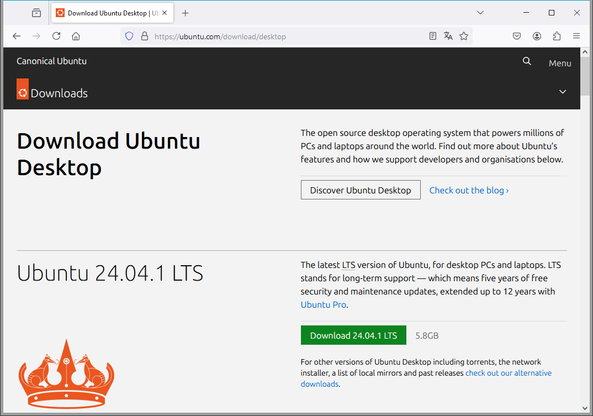
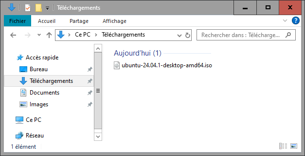

# Démarrer VMWare Workstation


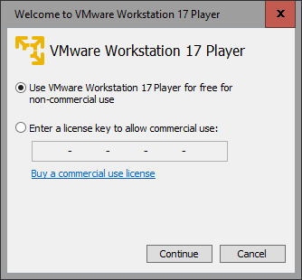

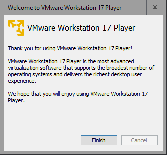

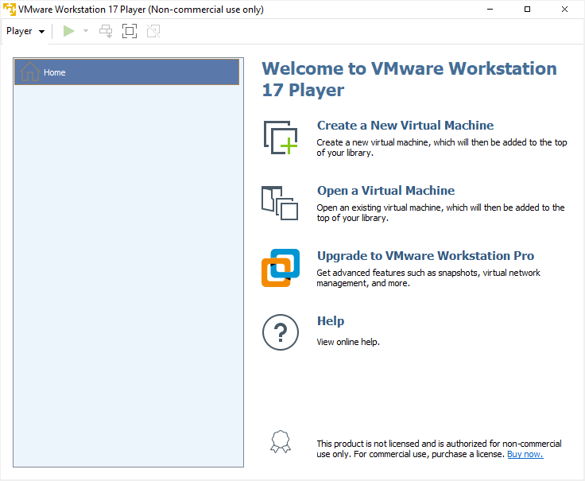

# Créer une nouvelle machine virtuelle
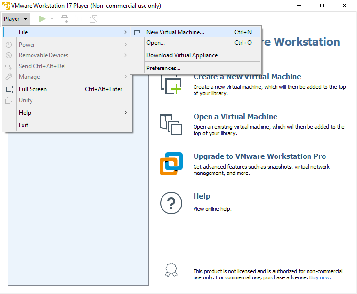

Sélectionner l'iso téléchargée:

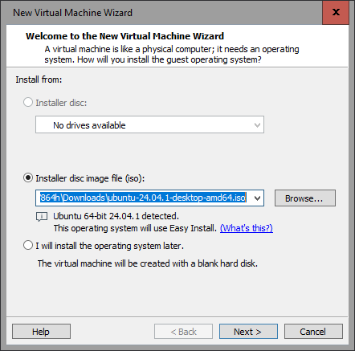

Etape inutile:

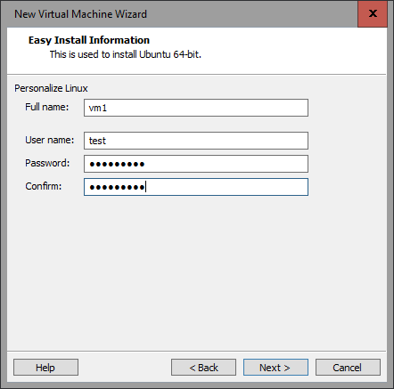

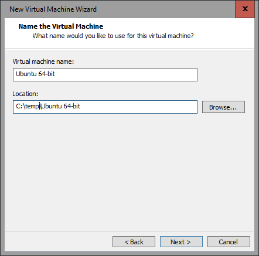

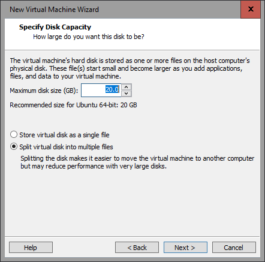

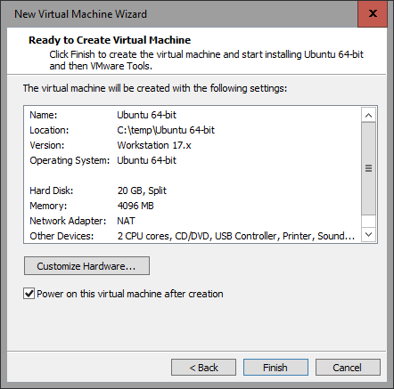

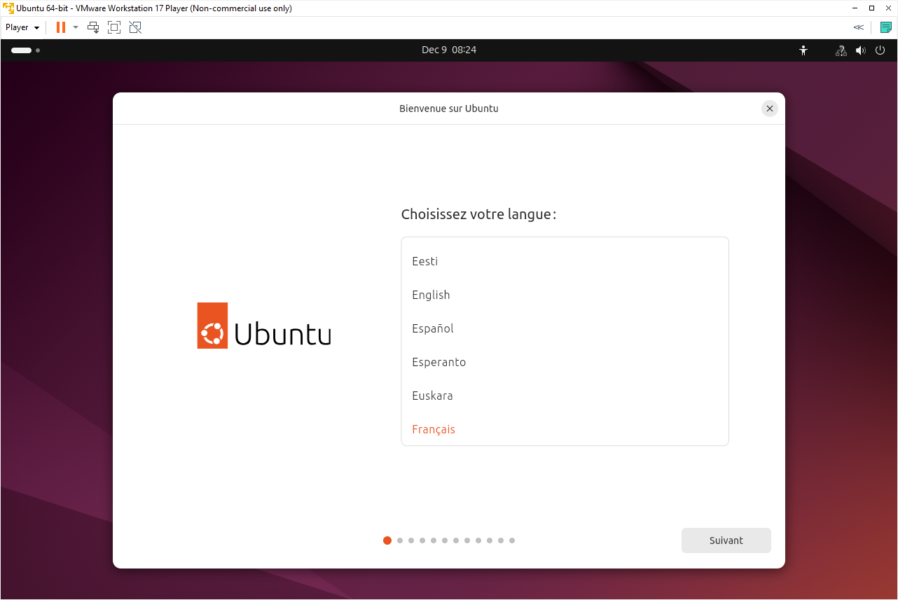

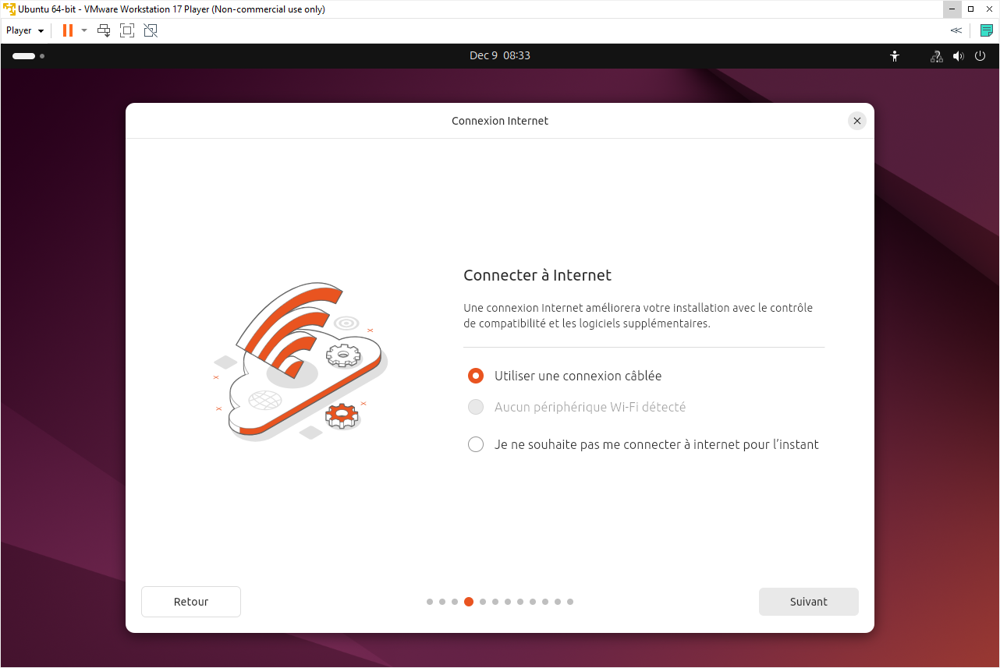

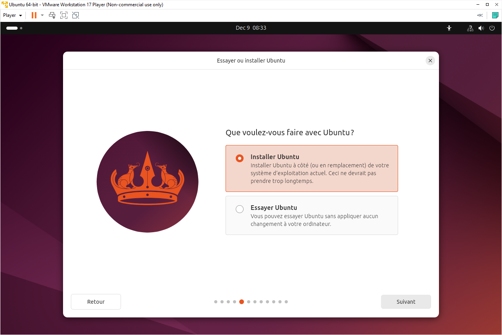

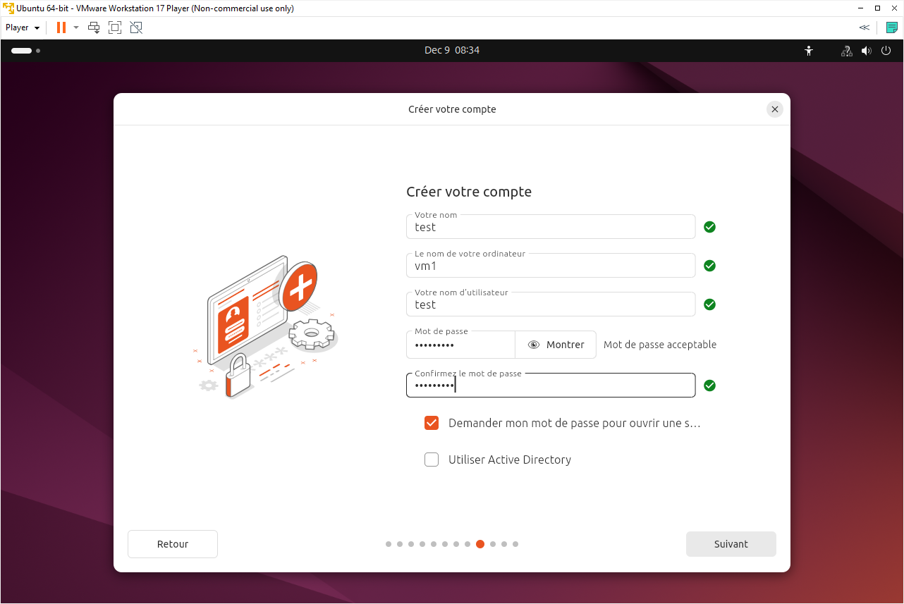

# Premier démarrage de la machine virtuelle:
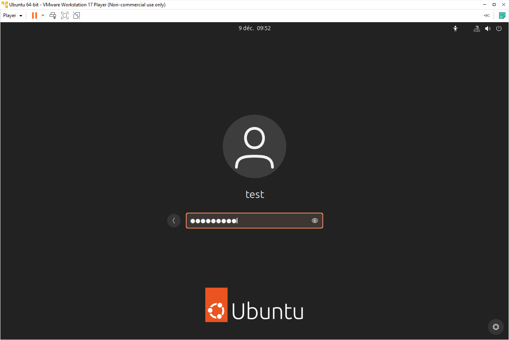

# Réseau
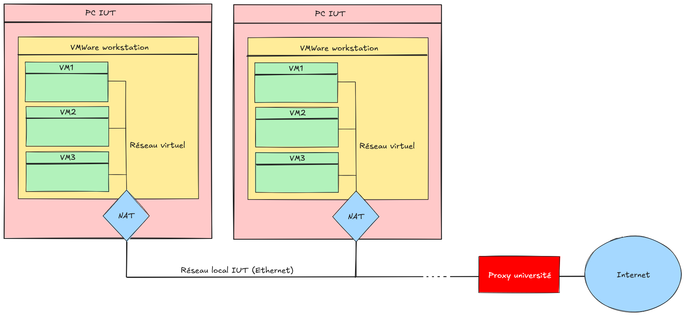

# Démarrer un terminal
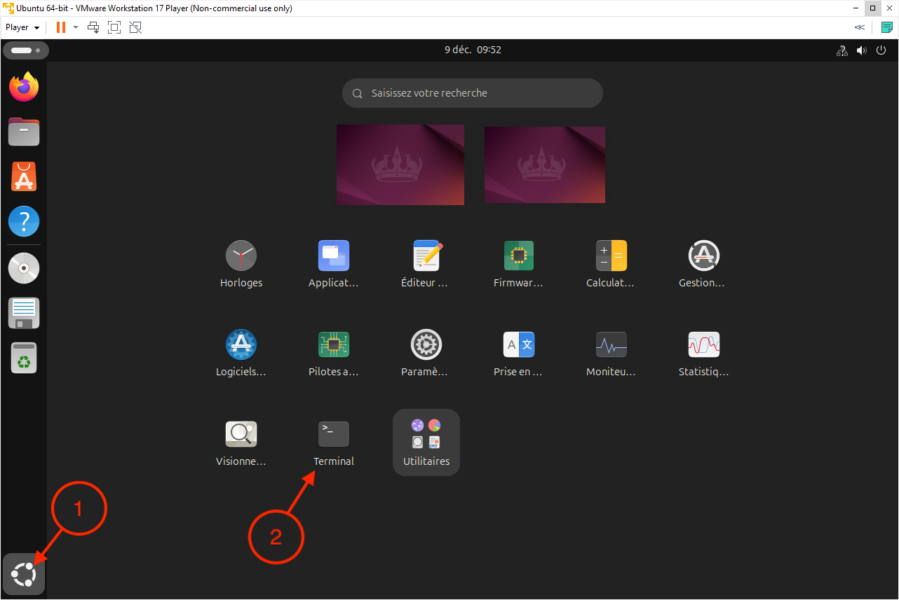

# Mise en place serveur ssh
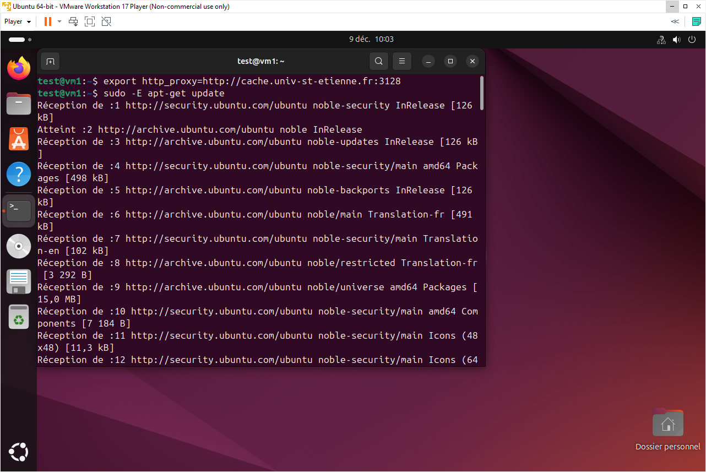

```
export http_proxy=http://cache.univ-st-etienne.fr:3128
sudo -E apt-get update
sudo -E apt-get install openssh-server
```

# Connexion ssh depuis la machine hote
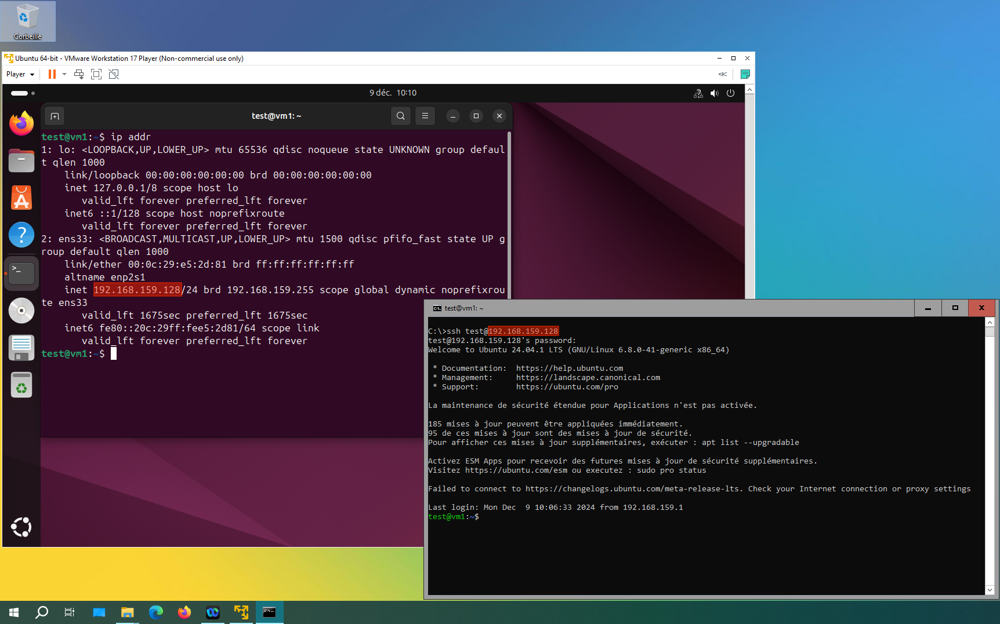
