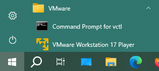

# Téléchargement iso Ubuntu


# Démarrer VMWare Workstation



# Créer une nouvelle machine virtuelle


Sélectionner l'iso téléchargée:


Etape inutile:


# Premier démarrage de la machine virtuelle:


# Réseau


# Démarrer un terminal


# Mise en place serveur ssh


```
export http_proxy=http://cache.univ-st-etienne.fr:3128
sudo -E apt-get update
sudo -E apt-get install openssh-server
```

# Connexion ssh depuis la machine hote

