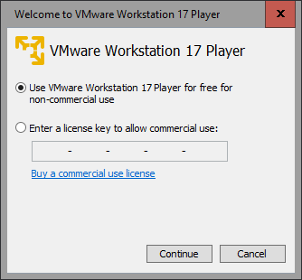
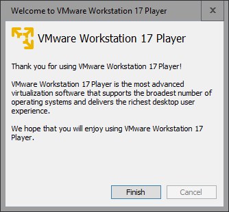
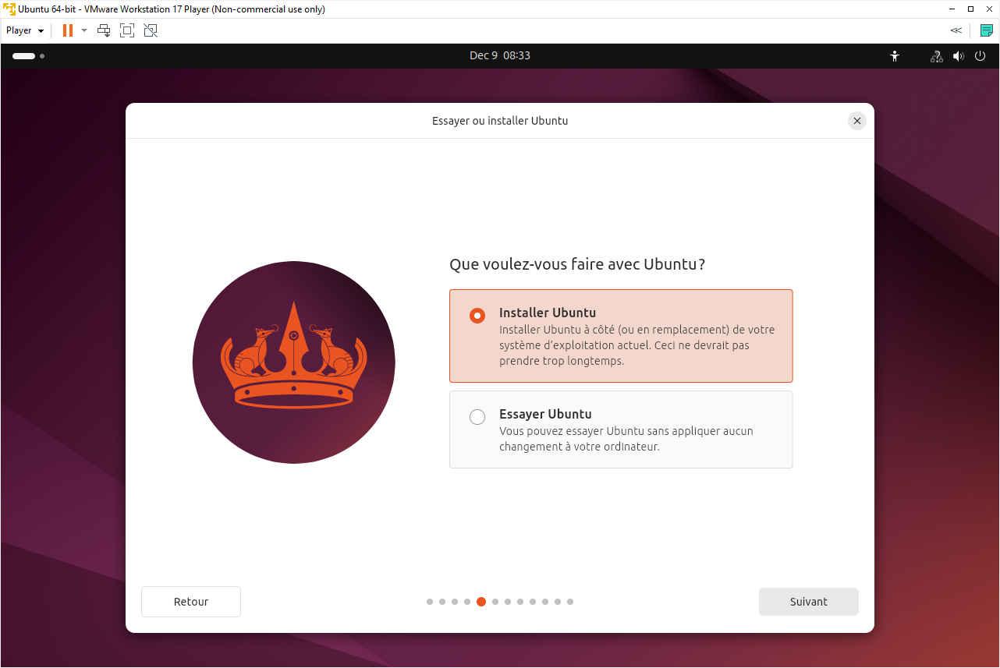
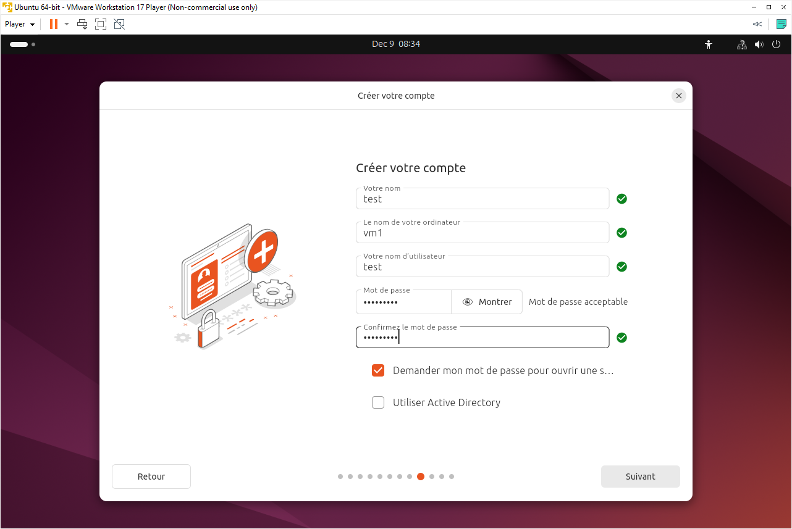
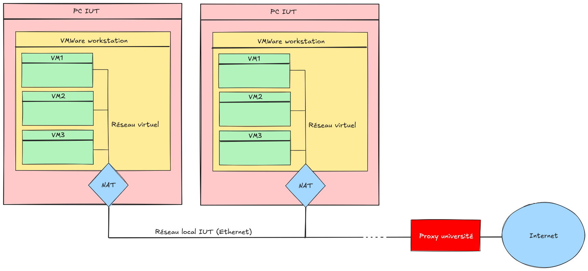
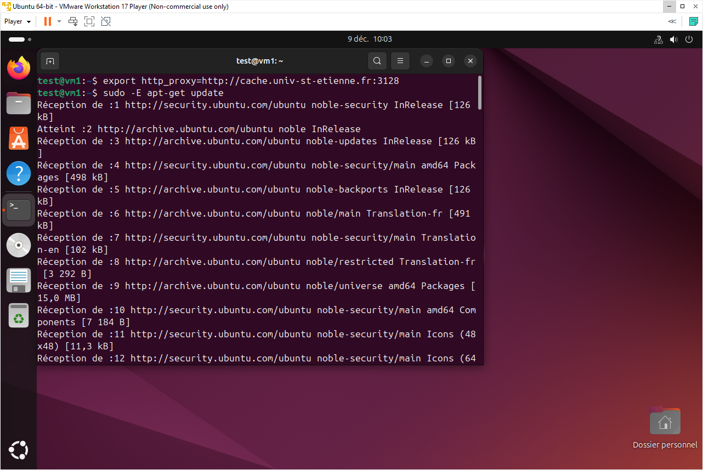

# Commandes Unix à connaitre
pwd
ls
cd
rm
mkdir
rmdir
rm -rf
mv
cp
touch
cat
whoami
adduser
usermod -aG [groupe] [utilisateur]
su
sudo
chmod
ip addr / ifconfig
gcc
apt-get update
apt-get install [paquet]
systemctl

# Intro virtualisation


# VMWare workstation (hyperviseur de type 2)

## Téléchargement iso Ubuntu


## Démarrer VMWare Workstation







## Créer une nouvelle machine virtuelle


Sélectionner l'iso téléchargée:


Etape inutile:






## Premier démarrage de la machine virtuelle:


## Réseau


## Démarrer un terminal


## Mise en place serveur ssh


```
export http_proxy=http://cache.univ-st-etienne.fr:3128
sudo -E apt-get update
sudo -E apt-get install openssh-server
```

## Connexion ssh depuis la machine hote


# Introduction à Docker

## Recap

### Installation de docker
sudo apt-get install docker.io
sudo usermod -aG docker [utilisateur]

### Commandes principales

docker pull [nomimage]
docker images

docker run [nomimage]
  -d
  -v /cheminhote:/chemincontainer
  -p 8080:80     (porthote:portcontainer)
  -it
  [commande]

docker exec -it [idcontainer] [commande]

docker ps
docker ps -a
docker stop [idcontainer]
docker rm [idcontainer]

docker cp [fichierhote] [idcontainer]:[fichiercontainer]

docker logs [idcontainer]

### Creation d'une image docker

Dockerfile:
  FROM
  COPY
  CMD

docker build -t [nomimage] .
docker build -t [nomimage]:1.0.0 .
docker tag [nomimage]:3.0.0 [nomimage]:latest

### docker compose
Voir projet TODO

## Rappel pour les manipulations à l'IUT
- Il n'est malheureusement pas possible d'utiliser docker sur vos PC.
- Connectez vous sur le site https://labs.play-with-docker.com/
- Une machine virtuelle est à votre disposition en cliquant sur "Add new instance".
- Vous pouvez utiliser docker sur cette machine virtuelle.


## Exercice 1

- Déployez un container docker sur la machine virtuelle:
  - Image: nginx (Serveur web)
  - Mode détaché.
  - Redirection du port tcp 80 de la VM hôte vers le port tcp 80 du container.
  - Le contenu du dossier /usr/share/nginx/html/ du container devra être "lié" au dossier /root/volume1/ de la machine virtuelle hôte.

- Créez une page index.html dans /root/volume1/ sur votre machine virtuelle hôte.
- Accédez à cette page depuis votre navigateur web.


Rappel: Une seconde redirection de port est requise au niveau de la machine virtuelle pour que le port 80 soit accessible depuis l'extérieur.


## Exercice 2
- Vous avez réussi à mettre en place un serveur web et à héberger une page html simple.
- On souhaite désormais héberger une version html du jeu vidéo tetris.
- Le code source est disponible à cette adresse: https://github.com/bsord/tetris
- L’objectif est de pouvoir jouer à tetris depuis votre navigateur.
-	Construisez votre propre image Docker prête à l’emploi, qui intègre le serveur web nginx, ainsi que ce jeu vidéo.

## Exercice 3
- Ecrivez un programme en C qui affiche un message "Hello", suivi d’un numéro de version.
- Créez une image Docker minimaliste qui intègre le binaire de ce programme.
- Lorsque l’on voudra créer et lancer un container basé sur cette image, le programme devra être exécuté automatiquement.
- Ecrivez successivement différentes versions de ce programme en changeant simplement le numéro. Imaginez qu’il s’agit en réalité d’un programme plus complexe et que chaque nouvelle version est le fruit de plusieurs semaines de travail.
- Créez plusieurs images Docker qui embarquent les différentes versions de ce programme. (Utilisez les tags). Faites en sorte que le tag "latest" désigne systématiquement la dernière version disponible.

## Exercice 4
- Cette image Docker est dépourvue de documentation: https://hub.docker.com/r/julien237/imagetestgeii
- Analysez là et décrivez ce qu’elle contient.

```
docker run -it julien237/imagetestgeii:latest
```

## Exercice 5
- Déployez un container docker qui héberge une base de données postgresql.
- Créez une base de données comportant une simple table: clients (champs id_client et nom)
- Créez un programme (dans le language de votre choix) qui permet de consulter la liste des clients et de créer un nouveau client. (Ce programme peut être une application console ou une application web) 
- Embarquez ce programme dans une image Docker.
- Trouvez une solution pour déployer les deux containers de la manière la plus simple possible (base de données et programme) 

# VMWare ESXi (hyperviseur de type 1)
